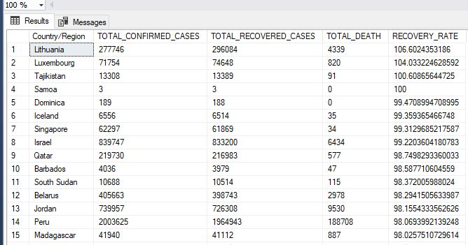

# CORONA-VIRUS DATA ANALYSIS

## INTRODUCTION
In today's data-driven world, information is king. But raw data itself holds little value unless we can extract its hidden stories and uncover meaningful trends. This is where SQL, a powerful query language, comes into play.
SQL empowers us to explore and analyze vast datasets, acting as a bridge between raw information and actionable insights. This exploration journey allows us to:
- Unveil patterns and trends: We can identify correlations, outliers, and hidden relationships within the data.
- Gain a deeper understanding: By drilling down into specific data points, we can gain a more nuanced perspective on the information.
- Prepare data for further analysis: SQL helps us clean, filter, and transform data, readying it for advanced statistical analysis or machine learning models.
  
In this exploration, we will explore a data-set to derive meaningful insights and present our findings

## PROJECT OVERVIEW
The corona-virus pandemic has had a significant impact on public health and has created an urgent need for data-driven insights to understand the spread of the virus. As a data analyst, I have been
tasked with analyzing a CORONA VIRUS dataset to derive meaningful insights and present your findings.

## DATA SETS
Description of each column in dataset:
- **Province**: Geographic subdivision within a country/region.
- **Country/Region**: Geographic entity where data is recorded.
- **Latitude**: North-south position on Earth's surface.
- **Longitude**: East-west position on Earth's surface.
- **Date**: Recorded date of CORONA VIRUS data.
- **Confirmed**: Number of diagnosed CORONA VIRUS cases.
- **Deaths**: Number of CORONA VIRUS related deaths.
- **Recovered**: Number of recovered CORONA VIRUS cases.

## DATA CLEANING
I addressed missing values for data integrity. I replaced Null values with zeros, I corrected some column datatypes to their formats.

## DATA EXPLORATION AND ANALYSIS
1. What is the total number of rows?

 QUERY                                   |        RESULT
:--------------------------------------:|:----------------------------------------------|
                       |          

2. What is the start-date and end-date?

 QUERY                                   |        RESULT
:--------------------------------------:|:-----------------------------------------------|
                       |          

3. What Number of month is present in dataset?

 QUERY                                   |        RESULT
:--------------------------------------:|:-----------------------------------------------|
                       |          

4. What is monthly average for confirmed, deaths, recovered?

 QUERY                                   |        RESULT
:--------------------------------------:|:-----------------------------------------------|
                       |          

5. What is the most frequent value for confirmed, deaths, recovered each month? 

 QUERY                                   |        RESULT
:--------------------------------------:|:-----------------------------------------------|
                       |          

6. What is the minimum values for confirmed, deaths, recovered per year?

 QUERY                                   |        RESULT
:--------------------------------------:|:-----------------------------------------------|
                       |          

7. What is the maximum values of confirmed, deaths, recovered per year?

 QUERY                                   |        RESULT
:--------------------------------------:|:-----------------------------------------------|
                       |          

8. What is the total number of case of confirmed, deaths, recovered each month?

 QUERY                                   |        RESULT
:--------------------------------------:|:-----------------------------------------------|
                       |          

9. How corona virus spread out with respect to confirmed case

 QUERY                                   |        RESULT
:--------------------------------------:|:-----------------------------------------------|
                       |          

10. How corona virus spread out with respect to death case per month

 QUERY                                   |        RESULT
:--------------------------------------:|:-----------------------------------------------|
                       |          

11. How corona virus spread out with respect to recovered case

 QUERY                                   |        RESULT
:--------------------------------------:|:-----------------------------------------------|
                       |          

12. How many number of countries?

 QUERY                                   |        RESULT
:--------------------------------------:|:-----------------------------------------------|
                       |          

13. Which Country have the highest number of the Confirmed case

 QUERY                                   |        RESULT
:--------------------------------------:|:-----------------------------------------------|
                       |          

14. Which Country have the lowest number of the death case

 QUERY                                   |        RESULT
:--------------------------------------:|:-----------------------------------------------|
                       |          

15.  Top 5 countries having highest recovered case

 QUERY                                   |        RESULT
:--------------------------------------:|:-----------------------------------------------|
                       |          

16.  Which countries have the highest recovery rates?

 QUERY                                   |        RESULT
:--------------------------------------:|:-----------------------------------------------|
                       |          

17.  Which countries have the lowest recovery rates ?

 QUERY                                   |        RESULT
:--------------------------------------:|:-----------------------------------------------|
                       |          

## CONCLUSION
1. Trend Analysis
- Overtime it was discovered that confirmed cases , deaths and recovery case increases
2. Spread Analysis
- The Standard deviation, Variance is high in respect to the average which shows the spread, variation is high and rapid in respect to all cases
3. Country Analysis
- We could discover that Turkey recorded the most confirmed case
- We also discovered countries with significant recovery rate such as Israel, Samoa, Lithuania

